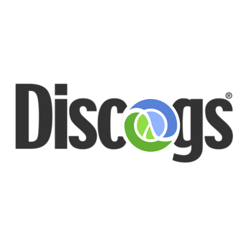

# discogs  

> [!NOTE]
> A fully-featured, data-oriented, [Discogs](https://discogs.com) API Client written in pure clojure.

## Usage

### Create a Client

> TODO

### Interact With Database

> TODO

### Commons Algorithms

> TODO

## Disclaimer of Affiliation with Discogs

This software/library is an independent project developed by its author(s) and is not affiliated with, sponsored by,
or endorsed by Discogs or any of its subsidiaries. "Discogs" is a registered trademark of Discogs Inc.

The use of the "Discogs" name and any related trademarks within this project is for identification and descriptive purposes only
and does not imply any connection, endorsement, or approval by Discogs Inc.

## License

Copyright © 2025 iomonad

This program and the accompanying materials are made available under the
terms of the Eclipse Public License 2.0 which is available at
http://www.eclipse.org/legal/epl-2.0.

This Source Code may also be made available under the following Secondary
Licenses when the conditions for such availability set forth in the Eclipse
Public License, v. 2.0 are satisfied: GNU General Public License as published by
the Free Software Foundation, either version 2 of the License, or (at your
option) any later version, with the GNU Classpath Exception which is available
at https://www.gnu.org/software/classpath/license.html.
